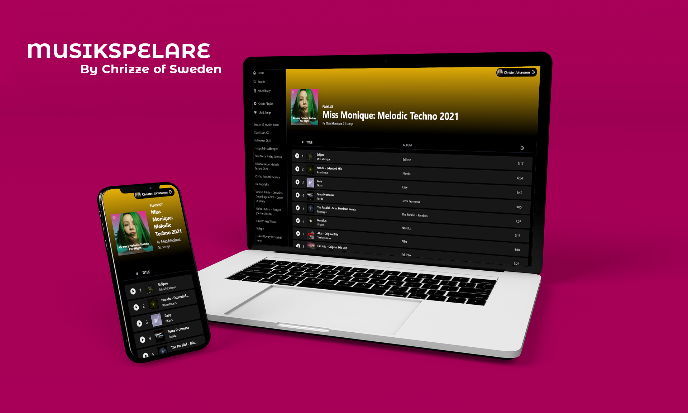
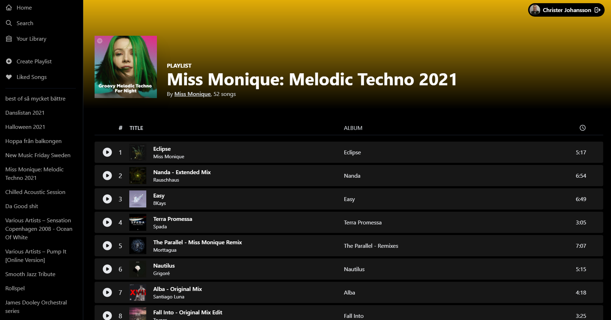
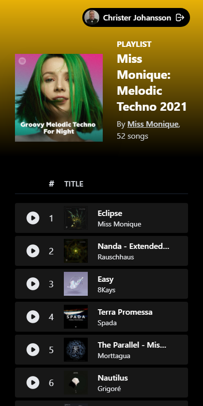
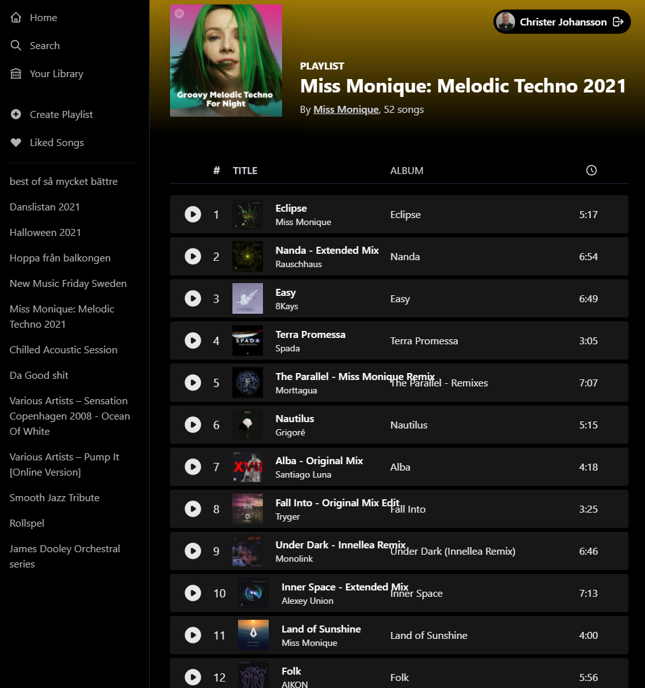

# ReactSpot - Musikspelare 🔥

Add some react to your Spotify music playlists 🎧

## Built With

- [Next.js](https://nextjs.org/)
- [React](https://reactjs.org/)
- [Tailwind CSS](https://tailwindcss.com/) [(v3.0)](https://tailwindcss.com/blog/tailwindcss-v3)
- [NextAuth](https://next-auth.js.org/)
- [Recoil](https://recoiljs.org/)
- [Spotify Web API](https://developer.spotify.com/documentation/web-api/)

## Preview



## Getting Started

To get a local copy up and running follow these simple steps.

### Prerequisites

**_We strictly use [yarn](https://yarnpkg.com/) for managing the packages/dependencies of the React app. You need to install [yarn](https://yarnpkg.com/) to successfully run this project locally._**

- npm

  ```sh
  npm install npm@latest -g
  ```

- yarn
  ```sh
  npm install -g yarn
  ```

### Installation

1.  Fork the project first

2.  Clone the forked repo

    ```sh
    git clone https://github.com/christerjohansson/musikspelare.git
    ```

3.  Go to the project directory, create a `.env` file

    ```sh
    NEXTAUTH_URL = "http://localhost:3000"
    NEXT_PUBLIC_CLIENT_SECRET = "Spotify Client Secret"
    NEXT_PUBLIC_CLIENT_ID = "Spotify Client Id"
    JWT_SECRET = "a very secret string, anything at all"
    ```

    Install the packages using

    ```sh
    yarn
    ```

    or

    ```sh
    yarn install
    ```

4. Go to Spotify Developers [Dashboard](https://developer.spotify.com).
- Add a new application and give it a proper name.
- Make sure to add ```http://localhost:3000``` as website URL.
- Then add a Redirect URI as well: ```http://localhost:3000/api/auth/callback/spotify/```
(If you get INVALID REDIRECT URI, edit the Redirect URI, or add a new one without a traililng slash)
- Save your changes!

5.  Run the app in the development mode using

    ```sh
    yarn dev
    ```

    Open [http://localhost:3000](http://localhost:3000) to view it in the browser.
    The page will reload if you make edits.

## Screenshots
<p>



</p>

<!-- CONTRIBUTING -->

## Contributing

Contributions are what make the open source community such an amazing place to learn, inspire, and create. Any contributions you make are **greatly appreciated**.

1. Fork the Project
2. Create your Feature Branch ( `git checkout -b feature/AmazingFeature` )
3. Add your Changes ( `git add .` )
4. Commit your Changes ( `git commit -m 'Add some AmazingFeature'` )
5. Push to the Branch ( `git push origin feature/AmazingFeature` )
6. Open a Pull Request

<!-- LICENSE -->

## License

Distributed under the **MIT License**. See [`LICENSE`](https://github.com/niloysikdar/Spotifire/blob/main/LICENSE) for more information.
